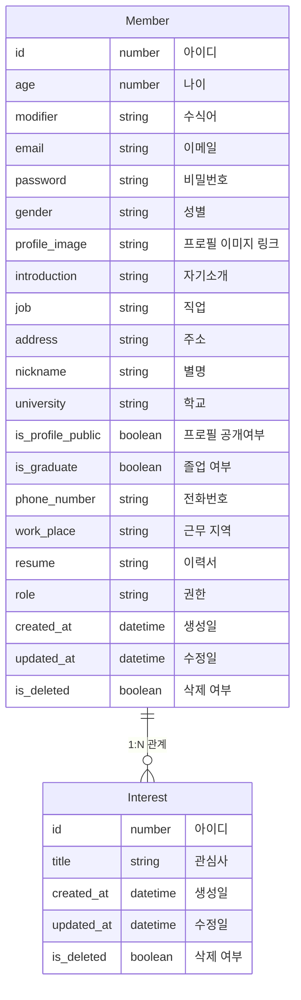
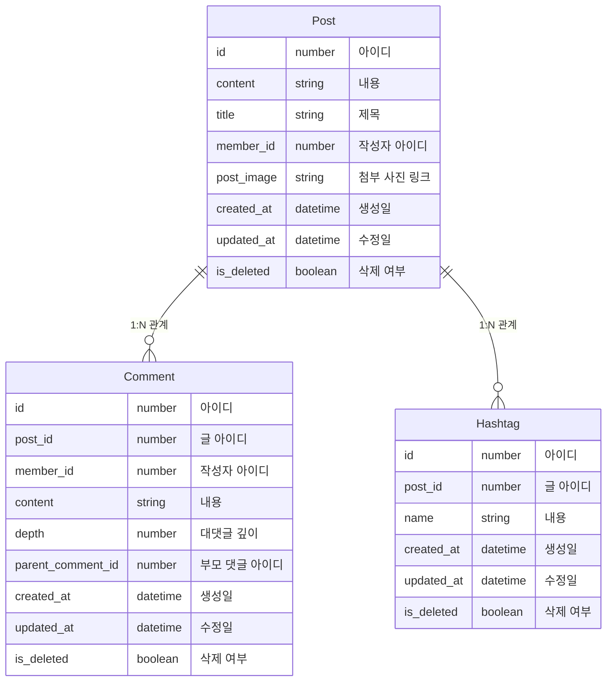
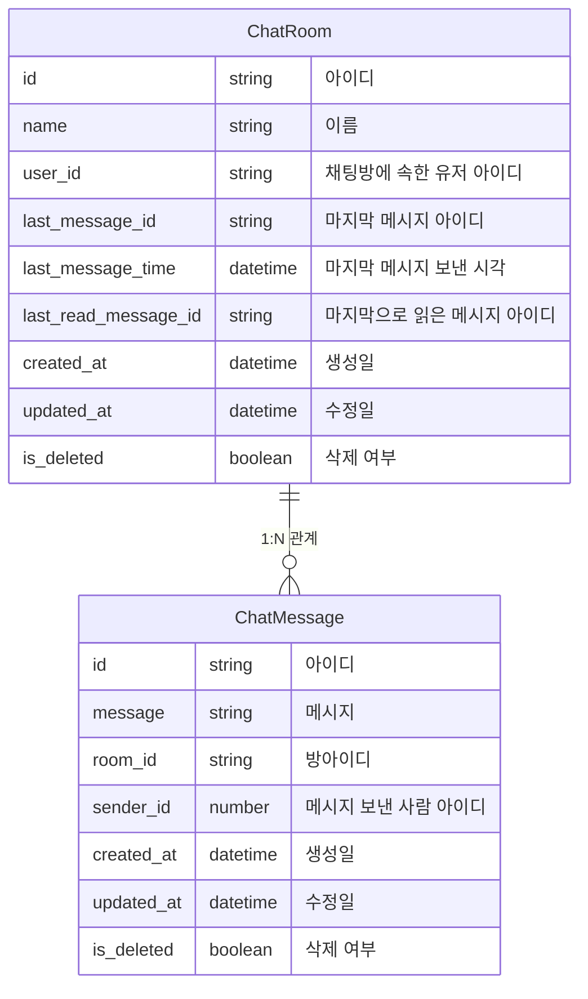

## 유저

```mermaid
erDiagram
	Member {
	  id number "아이디"
	  age number "나이"
	  modifier string "수식어"
	  email string "이메일"
	  password string "비밀번호"
	  gender string "성별"
	  profile_image string "프로필 이미지 링크"
	  introduction string "자기소개"
	  job string "직업"
	  address string "주소"
	  nickname string "별명"
	  university string "학교"
	  is_profile_public boolean "프로필 공개여부"
	  is_graduate boolean "졸업 여부"
	  phone_number string "전화번호"
	  work_place string "근무 지역"
	  resume string "이력서"
	  role string "권한"
	  created_at datetime "생성일"  
	  updated_at datetime "수정일"
	  is_deleted boolean "삭제 여부"
  }
  
  Interest {
	  id number "아이디"
	  title string "관심사"
	  created_at datetime "생성일"  
    updated_at datetime "수정일"
    is_deleted boolean "삭제 여부"
  }
  
	Member ||--o{ Interest : "1:N 관계"
```

## 게시물

```mermaid
erDiagram
	Post {
	  id number "아이디"
	  content string "내용"
	  title string "제목"
	  member_id number "작성자 아이디"
	  post_image string "첨부 사진 링크"
	  created_at datetime "생성일"  
	  updated_at datetime "수정일"
	  is_deleted boolean "삭제 여부"
  }
  
  Comment {
	  id number "아이디"
		post_id number "글 아이디"
		member_id number "작성자 아이디"
		content string "내용"
		depth number "대댓글 깊이"
		parent_comment_id number "부모 댓글 아이디"
	  created_at datetime "생성일"  
    updated_at datetime "수정일"
    is_deleted boolean "삭제 여부"
  }
  
  Hashtag {
  	id number "아이디"
		post_id number "글 아이디"
		name string "내용"
	  created_at datetime "생성일"  
    updated_at datetime "수정일"
    is_deleted boolean "삭제 여부"
  }
  
	Post ||--o{ Comment : "1:N 관계"
	Post ||--o{ Hashtag : "1:N 관계"
```

## 채팅

```mermaid
erDiagram
	ChatRoom {
	  id string "아이디"
	  name string "이름"
	  user_id string "채팅방에 속한 유저 아이디"
	  last_message_id string "마지막 메시지 아이디"
	  last_message_time datetime "마지막 메시지 보낸 시각"
	  last_read_message_id string "마지막으로 읽은 메시지 아이디"
	  created_at datetime "생성일"  
	  updated_at datetime "수정일"
	  is_deleted boolean "삭제 여부"
  }
  
  ChatMessage {
	  id string "아이디"
	  message string "메시지"
	  room_id string "방아이디"
	  sender_id number "메시지 보낸 사람 아이디"
	  created_at datetime "생성일"  
    updated_at datetime "수정일"
    is_deleted boolean "삭제 여부"
  }
  
	ChatRoom ||--o{ ChatMessage : "1:N 관계"
```